# 🌟 GlowAI

<div align="center">

### AI-Powered Skincare Ecommerce Platform


**Personalized skincare powered by AI.**

GlowAI combines intelligent skin analysis, personalized product recommendations, an AI skincare assistant, and a modern e-commerce experience into one platform.

### 🚀 [Live Demo](https://glow-ai-boutique.lovable.app)

</div>

---

# 📸 Product Preview

> Replace the placeholder images below with screenshots from the actual application.

## 🏠 Homepage


## 🤖 AI Skin Analysis


## 🛍️ Product Catalog


## 💬 AI Skincare Assistant


## 👤 Personal Dashboard


## 🛒 Shopping Experience


---

# ✨ Overview

GlowAI is a modern skincare e-commerce platform designed to personalize the shopping experience using AI-assisted skin analysis and recommendation algorithms.

Instead of presenting every customer with the same catalog, GlowAI builds a personalized understanding of the user's:

* Skin type
* Skin concerns
* Sensitivity
* Hydration needs
* Age
* Climate
* Lifestyle
* Product preferences
* Existing skincare routine

The platform then uses this profile to generate product compatibility scores and personalized skincare routines.

---

# 🎯 Product Vision

Traditional skincare shopping can be overwhelming.

Hundreds of products, thousands of ingredients, and conflicting advice make it difficult for customers to determine what actually fits their skin.

GlowAI addresses this problem through:

```text
                    👤 USER
                       │
                       ▼
              ┌─────────────────┐
              │  Skin Analysis  │
              └────────┬────────┘
                       │
                       ▼
              ┌─────────────────┐
              │ AI Skin Profile │
              └────────┬────────┘
                       │
                       ▼
            ┌──────────────────────┐
            │ Recommendation Engine│
            └──────────┬───────────┘
                       │
             ┌─────────┼─────────┐
             ▼         ▼         ▼
          Products   Routine   Assistant
             │         │         │
             └─────────┼─────────┘
                       ▼
                🛍️ PERSONALIZED
                  EXPERIENCE
```

---

# ⭐ Key Highlights

| Capability            | Description                               |
| --------------------- | ----------------------------------------- |
| 🤖 AI Skin Analysis   | Multi-factor personalized skin assessment |
| 🎯 AI Recommendations | Product compatibility scoring             |
| 🧴 Product Discovery  | Curated skincare catalog                  |
| 💬 AI Assistant       | Context-aware skincare guidance           |
| 🧘 Routine Builder    | Personalized AM/PM routines               |
| 📊 Progress Tracking  | Monitor skincare journey                  |
| ❤️ Wishlist           | Save and organize products                |
| 🛒 Smart Cart         | Personalized add-on suggestions           |
| 🔐 Authentication     | Supabase-powered authentication           |
| 📱 Responsive UI      | Mobile, tablet and desktop support        |

---

# 🚀 Features

## 🤖 AI-Powered Skin Analysis

GlowAI evaluates multiple dimensions of a user's skincare profile.

### Analysis Factors

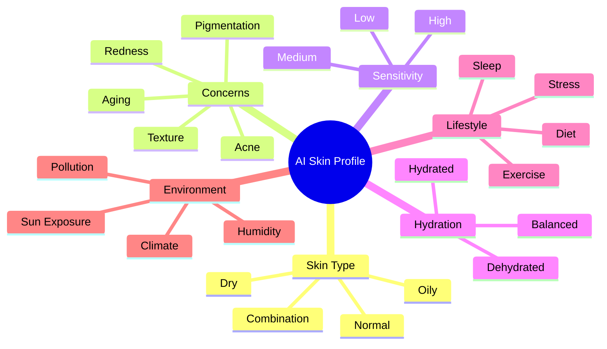

The result is a structured profile that can be used by the recommendation engine.

---

# 🧠 Recommendation Engine

GlowAI uses a compatibility-scoring approach to rank products against a user's skin profile.

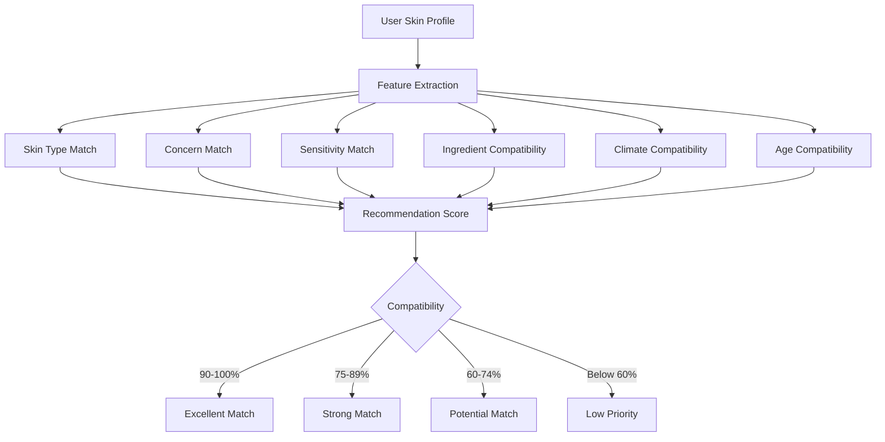

---

# 📊 Recommendation Scoring

A conceptual scoring model:

```text
Recommendation Score
        │
        ├── Skin Type Compatibility
        ├── Concern Compatibility
        ├── Sensitivity Compatibility
        ├── Ingredient Compatibility
        ├── Climate Compatibility
        └── Lifestyle Compatibility
                    │
                    ▼
              Final Score
                    │
                    ▼
           Personalized Ranking
```

Example:

```text
Skin Type Match          25%
Concern Match            25%
Ingredient Compatibility 20%
Sensitivity              15%
Climate                  10%
Lifestyle                 5%
────────────────────────────
Total                   100%
```

> These weights represent an example architecture and should be adjusted according to the actual recommendation implementation.

---

# 📈 Example Recommendation Chart

The following illustrates how a recommendation engine can compare product compatibility.

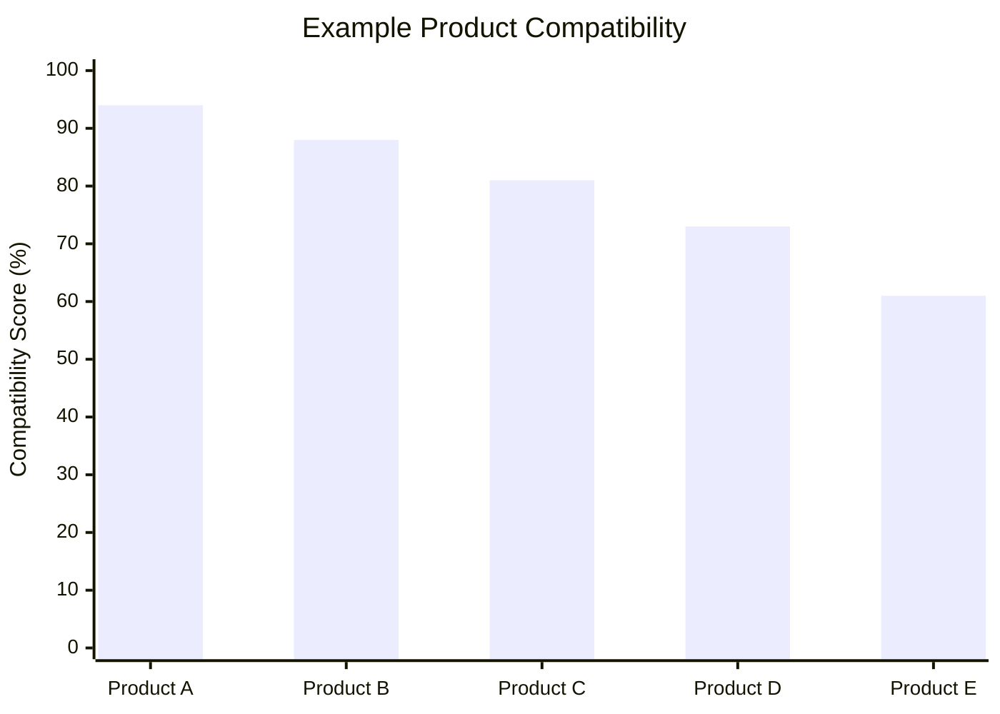

> The chart uses illustrative values for documentation and should not be presented as measured production data.

---

# 🛍️ Product Catalog

GlowAI provides a curated product discovery experience.

### Product information can include:

* Product name
* Brand
* Category
* Price
* Rating
* Ingredients
* Skin types
* Skin concerns
* Usage instructions
* AI compatibility score
* Recommended frequency
* Product benefits
* Potential sensitivities

---

# 🧴 Product Discovery Flow

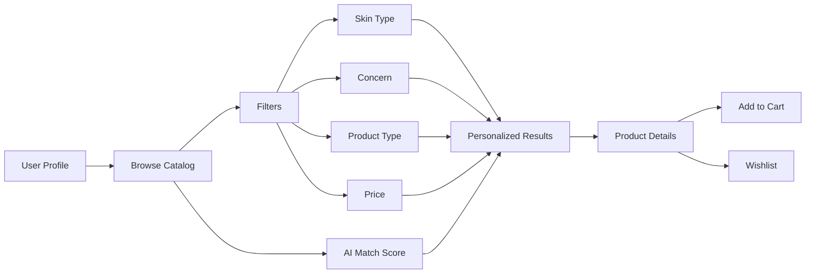

---

# 💬 AI Skincare Assistant

GlowAI includes an intelligent conversational assistant designed to help users navigate their skincare journey.

### Example questions

```text
"What cleanser is best for my skin?"

"How should I build my morning routine?"

"Can I use these two products together?"

"Which product is best for acne?"

"When should I apply this serum?"

"Why did GlowAI recommend this product?"
```

---

# 🤖 AI Assistant Architecture

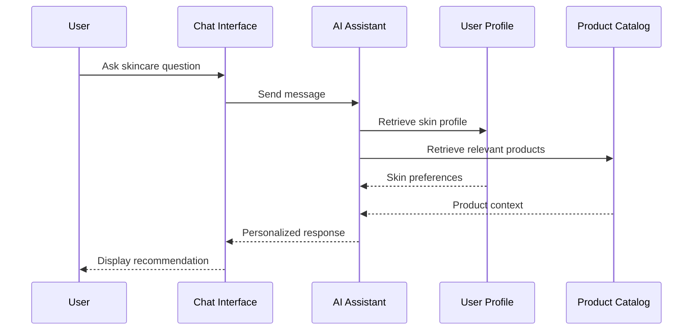

---

# 🧘 Personalized Routine Builder

GlowAI can generate skincare routines based on the user's profile and selected products.

## Morning Routine

```text
1. 🫧 Cleanser
       ↓
2. 💧 Toner / Essence
       ↓
3. ✨ Serum
       ↓
4. 🧴 Moisturizer
       ↓
5. ☀️ Sunscreen
```

## Evening Routine

```text
1. 🫧 Cleanser
       ↓
2. 💧 Treatment / Toner
       ↓
3. ✨ Active Serum
       ↓
4. 🧴 Moisturizer
       ↓
5. 🌙 Overnight Treatment
```

> Actual product sequencing should follow the application's recommendation logic and appropriate skincare guidance.

---

# 📊 User Journey

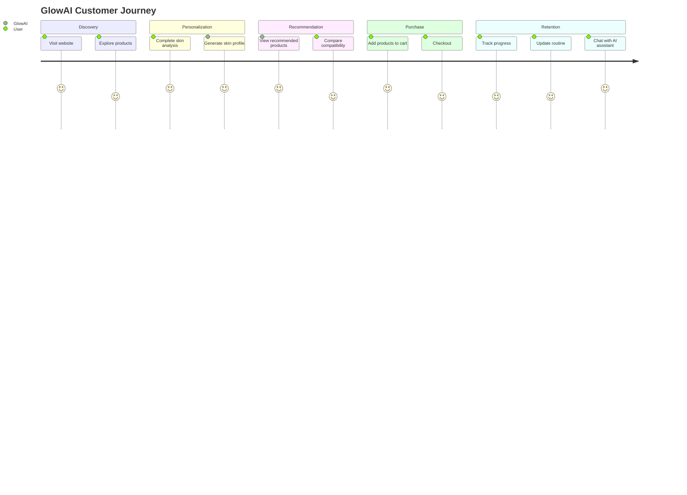

---

# 🛒 E-Commerce Experience

## Smart Shopping Cart

The cart experience can support:

* Product quantity management
* AI-recommended complementary products
* Bundle suggestions
* Price calculations
* Wishlist-to-cart actions
* Product removal
* Persistent cart state

---

# ❤️ Wishlist

Users can save products for later and organize their skincare shopping journey.

```text
Product
   │
   ├── ❤️ Add to Wishlist
   │
   ▼
Wishlist
   │
   ├── View Product
   ├── Remove
   └── Add to Cart
```

---

# 👤 Personal Dashboard

The dashboard acts as the central control panel for the customer's skincare journey.

### Dashboard sections

```text
┌───────────────────────────────────────────┐
│              GLOWAI DASHBOARD             │
├───────────────────────────────────────────┤
│                                           │
│  👤 Skin Profile                          │
│                                           │
│  🎯 Recommended Products                  │
│                                           │
│  🧘 Current Routine                       │
│                                           │
│  📈 Progress                              │
│                                           │
│  ❤️ Wishlist                              │
│                                           │
│  🛒 Orders                                │
│                                           │
│  💬 AI Assistant                          │
│                                           │
└───────────────────────────────────────────┘
```

---

# 📸 Progress Tracking

Users can track their skincare journey over time.

Potential tracking metrics:

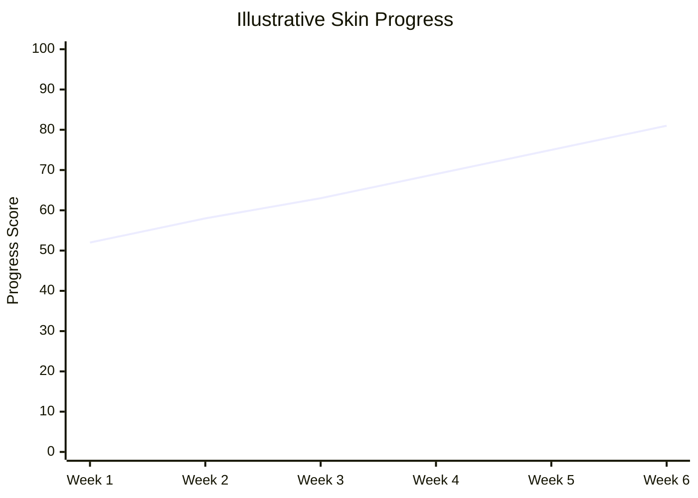

> These values are illustrative and should be replaced with actual user-derived metrics if implemented.

---

# 🗄️ Application Architecture

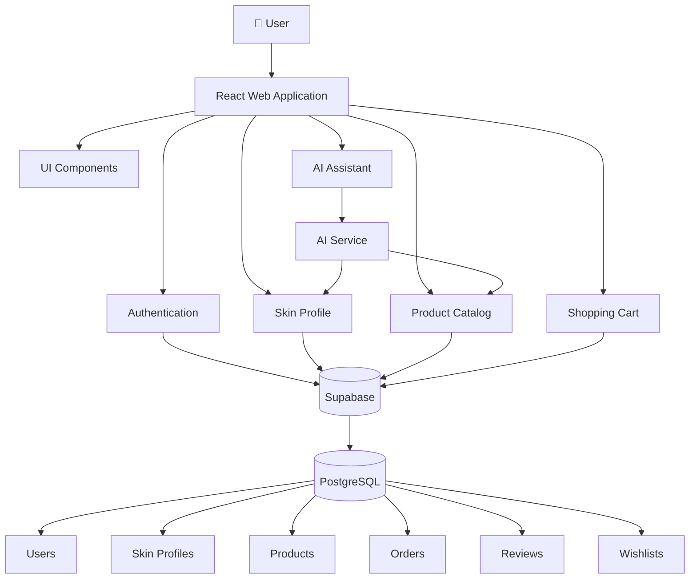

---

# 🔄 Complete Data Flow

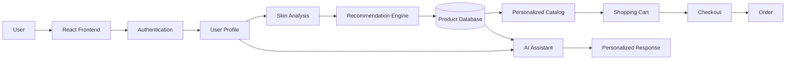

---

# 🧱 Technology Stack

## Frontend

| Technology   | Version | Purpose               |
| ------------ | ------: | --------------------- |
| React        |  18.3.1 | UI framework          |
| TypeScript   |   5.5.3 | Type-safe development |
| Vite         |   5.4.1 | Build tooling         |
| Tailwind CSS |  3.4.11 | Styling               |
| shadcn/ui    |       — | UI component system   |

## Backend / Infrastructure

| Technology | Purpose                                         |
| ---------- | ----------------------------------------------- |
| Supabase   | Authentication, database and backend services   |
| PostgreSQL | Relational data storage                         |
| AI Service | Personalized assistant and recommendation logic |
| Lovable    | Development/deployment workflow                 |
| Vite       | Application bundling                            |

---

# 📦 Dependencies

Core dependencies include:

```json
{
  "react": "18.3.1",
  "typescript": "5.5.3",
  "vite": "5.4.1",
  "@supabase/supabase-js": "2.50.3",
  "tailwindcss": "3.4.11"
}
```

Always refer to `package.json` as the source of truth for the exact dependency versions.

---

# 📁 Recommended Project Structure

```text
glow-ai/
│
├── public/
│   ├── favicon.ico
│   ├── robots.txt
│   └── images/
│
├── src/
│   │
│   ├── components/
│   │   ├── ui/
│   │   ├── products/
│   │   ├── skincare/
│   │   ├── dashboard/
│   │   ├── chatbot/
│   │   └── checkout/
│   │
│   ├── pages/
│   │   ├── Home.tsx
│   │   ├── Products.tsx
│   │   ├── ProductDetails.tsx
│   │   ├── SkinAnalysis.tsx
│   │   ├── Recommendations.tsx
│   │   ├── Dashboard.tsx
│   │   ├── Wishlist.tsx
│   │   ├── Cart.tsx
│   │   └── Checkout.tsx
│   │
│   ├── hooks/
│   ├── services/
│   │   ├── ai/
│   │   ├── products/
│   │   ├── orders/
│   │   └── users/
│   │
│   ├── integrations/
│   │   └── supabase/
│   │
│   ├── types/
│   ├── utils/
│   ├── lib/
│   │
│   ├── App.tsx
│   ├── main.tsx
│   └── index.css
│
├── docs/
│   ├── images/
│   │   ├── home.png
│   │   ├── skin-analysis.png
│   │   ├── product-catalog.png
│   │   ├── product-details.png
│   │   ├── ai-assistant.png
│   │   ├── dashboard.png
│   │   └── cart.png
│   │
│   └── architecture/
│       ├── overview.md
│       ├── recommendation-engine.md
│       └── database.md
│
├── .env.example
├── .gitignore
├── index.html
├── package.json
├── package-lock.json
├── tailwind.config.ts
├── tsconfig.json
├── vite.config.ts
└── README.md
```

---

# 🗃️ Database Architecture

A recommended relational model:

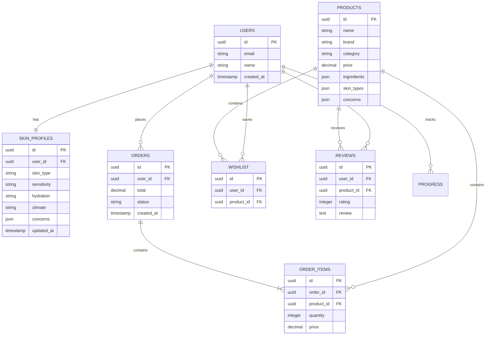

---

# 🔐 Authentication & Security

GlowAI uses Supabase Auth for user authentication.

Recommended security practices:

### Authentication

* Secure session handling
* Email/password authentication
* OAuth where appropriate
* Session expiration
* Account recovery

### Database

Use Row Level Security (RLS) to ensure users can only access authorized records.

Example policy concept:

```sql
CREATE POLICY "Users can access their own profile"
ON skin_profiles
FOR SELECT
USING (auth.uid() = user_id);
```

### Application Security

* Never expose secret API keys in frontend code
* Validate user input
* Sanitize external content
* Use HTTPS in production
* Apply least-privilege access
* Protect administrative endpoints
* Avoid storing sensitive payment information directly

---

# 💳 Payment Architecture

For a production implementation, payment processing should be delegated to a PCI-compliant payment provider.

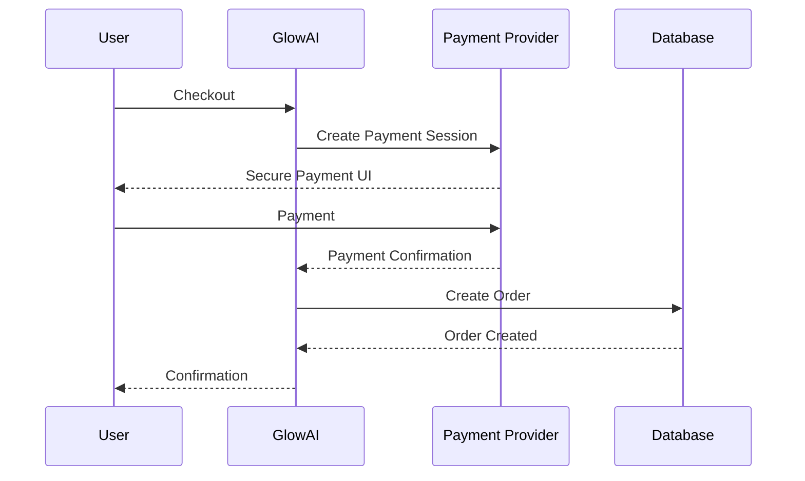

GlowAI should not store raw card numbers, CVVs or other sensitive payment credentials.

---

# 🔌 API Design

Recommended service structure:

```text
/api
│
├── /auth
│   ├── POST /login
│   ├── POST /signup
│   └── POST /logout
│
├── /skin
│   ├── GET  /profile
│   ├── POST /analysis
│   └── PUT  /profile
│
├── /products
│   ├── GET  /
│   ├── GET  /:id
│   └── GET  /recommendations
│
├── /recommendations
│   └── POST /generate
│
├── /assistant
│   └── POST /chat
│
├── /cart
│   ├── GET  /
│   ├── POST /
│   └── DELETE /:id
│
├── /wishlist
│   ├── GET  /
│   ├── POST /
│   └── DELETE /:productId
│
└── /orders
    ├── GET  /
    ├── GET  /:id
    └── POST /
```

---

# 💻 Example Recommendation Request

```http
POST /api/recommendations/generate
Content-Type: application/json
Authorization: Bearer <TOKEN>
```

```json
{
  "skinType": "combination",
  "concerns": [
    "acne",
    "hyperpigmentation"
  ],
  "sensitivity": "medium",
  "hydration": "low",
  "climate": "humid"
}
```

Example response:

```json
{
  "recommendations": [
    {
      "productId": "prod_001",
      "matchScore": 94,
      "reason": "Strong match for combination skin and acne concerns"
    },
    {
      "productId": "prod_002",
      "matchScore": 87,
      "reason": "Supports hydration while remaining lightweight"
    }
  ]
}
```

---

# 🧪 Testing Strategy

GlowAI should follow a layered testing strategy.

```text
                    E2E Tests
                       ▲
                       │
                Integration Tests
                       ▲
                       │
                   Unit Tests
                       ▲
                       │
                 Business Logic
```

## Unit Tests

Test:

* Recommendation calculations
* Skin-profile validation
* Cart calculations
* Product filtering
* Utility functions

## Integration Tests

Test:

* Supabase authentication
* Database operations
* Product retrieval
* Recommendation service
* Order creation

## End-to-End Tests

Test the complete customer journey:

```text
Landing Page
     ↓
Sign Up
     ↓
Skin Analysis
     ↓
AI Profile
     ↓
Recommendations
     ↓
Product Details
     ↓
Add to Cart
     ↓
Checkout
     ↓
Order Confirmation
```

---

# 📱 Responsive Design

GlowAI is designed for:

```text
┌─────────────────────────────────────┐
│             DESKTOP                 │
│                                     │
│  Navigation    Products    Profile  │
│                                     │
│       Personalized Dashboard        │
└─────────────────────────────────────┘


┌──────────────────────────┐
│          TABLET          │
│                          │
│     Product Grid         │
│                          │
│   AI Assistant           │
└──────────────────────────┘


┌────────────────┐
│    MOBILE      │
│                │
│  🏠 Home       │
│  🧴 Products   │
│  🤖 AI         │
│  ❤️ Wishlist   │
│  👤 Profile    │
│                │
└────────────────┘
```

---

# ⚡ Performance

Recommended performance targets:

| Metric                    |    Target |
| ------------------------- | --------: |
| Lighthouse Performance    |       90+ |
| First Contentful Paint    |    < 1.8s |
| Largest Contentful Paint  |    < 2.5s |
| Cumulative Layout Shift   |     < 0.1 |
| Interaction to Next Paint |   < 200ms |
| JavaScript Bundle         | Minimized |
| Image Delivery            | Optimized |

> These are recommended engineering targets, not measured GlowAI production benchmarks.

---

# 📊 Product Analytics

For production analytics, monitor:

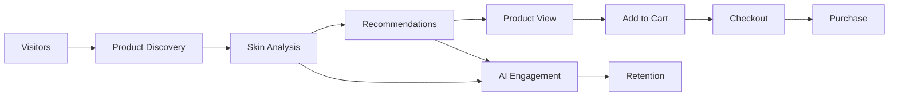

Recommended metrics:

| Category       | KPI                  |
| -------------- | -------------------- |
| Acquisition    | Visitors             |
| Engagement     | Session duration     |
| AI             | Analysis completion  |
| Recommendation | Recommendation CTR   |
| Commerce       | Add-to-cart rate     |
| Commerce       | Conversion rate      |
| Revenue        | Average order value  |
| Retention      | Repeat purchase rate |
| Assistant      | AI conversation rate |

---

# 📈 Illustrative Ecommerce Funnel

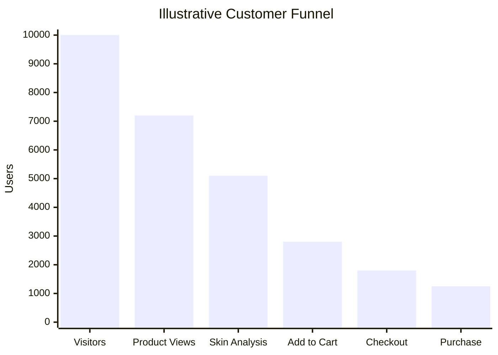

> These numbers are illustrative documentation data and are not actual GlowAI analytics.

---

# 🧴 Product Category Distribution

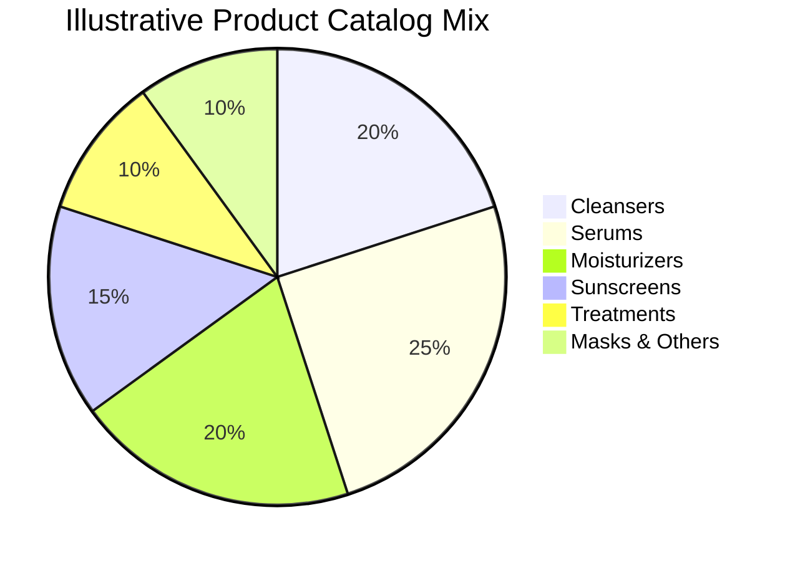

> Replace these values with actual catalog statistics if available.

---

# 🔄 AI Recommendation Lifecycle

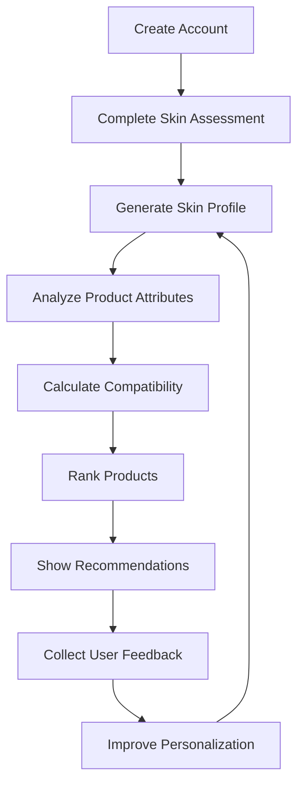

This creates a feedback loop where user preferences and product interactions can improve future personalization.

---

# 🛠️ Installation

## Prerequisites

Make sure you have:

* Node.js 18+
* npm
* Git
* Supabase project

Check your environment:

```bash
node --version
npm --version
git --version
```

---

# 📥 Clone Repository

```bash
git clone <YOUR_GIT_REPOSITORY_URL>

cd glow-ai
```

Install dependencies:

```bash
npm install
```

---

# ▶️ Start Development Server

```bash
npm run dev
```

The application will normally be available at:

```text
http://localhost:5173
```

---

# 🏭 Production Build

```bash
npm run build
```

Preview the production build:

```bash
npm run preview
```

---

# 🧹 Linting

```bash
npm run lint
```

Recommended pre-commit workflow:

```bash
npm install
npm run lint
npm run build
```

---

# 🔑 Environment Variables

Create:

```text
.env.local
```

Example:

```env
VITE_SUPABASE_URL=
VITE_SUPABASE_ANON_KEY=

VITE_AI_API_URL=

VITE_PAYMENT_PUBLIC_KEY=

VITE_ANALYTICS_ID=
```

Never commit:

```text
.env
.env.local
.env.production
```

### Important

Never expose:

* Supabase service-role keys
* Private AI API keys
* Payment secret keys
* Database credentials
* Internal service credentials

Frontend-exposed environment variables should contain only values that are safe for the browser.

---

# ☁️ Deployment

GlowAI can be deployed using Vercel or another modern frontend hosting provider.

Recommended deployment flow:

```text
Git Push
   │
   ▼
CI / Build
   │
   ├── Install Dependencies
   ├── Type Check
   ├── Lint
   └── Production Build
           │
           ▼
        Deploy
           │
           ▼
      CDN / Edge
           │
           ▼
        Users
```

---

# 🌎 Production Environment

Recommended environments:

```text
Development
     │
     ▼
Staging
     │
     ▼
Production
```

Each environment should use separate:

* Supabase projects
* API credentials
* Database data
* Analytics configuration
* Payment configuration

---

# 🔀 Git Workflow

Recommended branch strategy:

```text
main
 │
 ├── develop
 │
 ├── feature/ai-recommendations
 │
 ├── feature/skin-analysis
 │
 ├── feature/product-catalog
 │
 ├── feature/checkout
 │
 └── fix/authentication
```

Example:

```bash
git checkout -b feature/skin-analysis

git add .

git commit -m "feat: add AI skin analysis flow"

git push origin feature/skin-analysis
```

---

# 📝 Commit Convention

Use Conventional Commits:

```text
feat: add AI skin analysis
fix: resolve cart calculation issue
docs: update recommendation documentation
refactor: simplify product service
style: improve mobile product grid
test: add recommendation tests
chore: update dependencies
perf: optimize product loading
security: improve authentication flow
```

---

# 🧑‍💻 Development Guidelines

## React

Build small, reusable components.

```tsx
<ProductCard
  product={product}
  matchScore={94}
  onAddToCart={handleAddToCart}
/>
```

## TypeScript

Prefer explicit interfaces:

```ts
interface SkinProfile {
  skinType: string;
  sensitivity: string;
  hydration: string;
  concerns: string[];
  climate: string;
}
```

Avoid unnecessary:

```ts
const profile: any = {};
```

## Services

Keep business logic outside UI components:

```text
components/
     ↓
hooks/
     ↓
services/
     ↓
Supabase / API
```

---

# 🔐 Privacy & Responsible AI

Skincare recommendations can influence real-world purchasing and personal-care decisions.

GlowAI should therefore:

* Clearly explain that AI recommendations are informational.
* Avoid claiming to diagnose medical conditions.
* Encourage professional dermatological advice for serious or persistent conditions.
* Protect user skin-profile information.
* Avoid collecting unnecessary sensitive information.
* Provide transparency around recommendation logic where practical.

---

# 🗺️ Roadmap

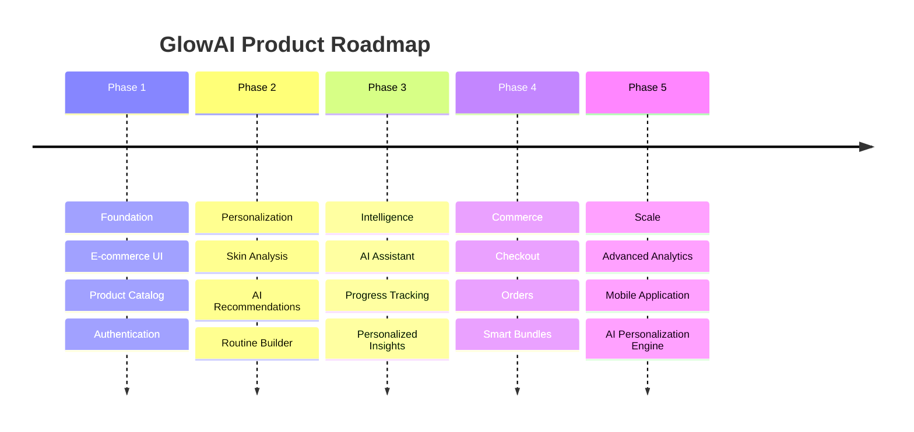

---

# 🚀 Future Enhancements

## 🤖 AI

* [ ] Explainable recommendation scores
* [ ] Ingredient compatibility analysis
* [ ] Personalized routine optimization
* [ ] Conversational product search
* [ ] AI-powered routine adjustments
* [ ] Image-assisted skin analysis

## 🛍️ Ecommerce

* [ ] Advanced product filtering
* [ ] Subscription orders
* [ ] Smart bundles
* [ ] Personalized promotions
* [ ] Loyalty program
* [ ] Product comparison

## 📊 Analytics

* [ ] Customer analytics dashboard
* [ ] Recommendation conversion tracking
* [ ] Product performance analytics
* [ ] Retention analytics
* [ ] A/B testing

## 📱 Platform

* [ ] Progressive Web App
* [ ] Native mobile application
* [ ] Push notifications
* [ ] Multi-language support
* [ ] Multi-region support

---

# 🧪 Quality Checklist

Before submitting a production change:

```text
☐ Feature works locally
☐ Mobile layout tested
☐ Desktop layout tested
☐ TypeScript errors resolved
☐ ESLint passes
☐ Production build succeeds
☐ Authentication tested
☐ Database permissions checked
☐ API errors handled
☐ Loading states implemented
☐ Empty states implemented
☐ Accessibility reviewed
☐ Sensitive data protected
```

---

# 🤝 Contributing

Contributions are welcome.

### 1. Fork

Create your own fork of the repository.

### 2. Create a branch

```bash
git checkout -b feature/my-feature
```

### 3. Make your changes

Follow the project's TypeScript, React and Tailwind conventions.

### 4. Validate

```bash
npm run lint
npm run build
```

### 5. Commit

```bash
git commit -m "feat: add my feature"
```

### 6. Push

```bash
git push origin feature/my-feature
```

### 7. Open a Pull Request

Describe:

* What changed
* Why it changed
* How it was tested
* Screenshots for UI changes

---

# 📄 License

Add the project's official license here.

For example:

```text
MIT License
```

If GlowAI is proprietary, replace this section with the appropriate proprietary-license statement.

---

# 🔗 Project Links

| Resource         | Link                                 |
| ---------------- | ------------------------------------ |
| 🌐 Live Demo     | https://glow-ai-boutique.lovable.app |
| 💻 Lovable       | Lovable project workspace            |
| 📚 Documentation | `/docs`                              |
| 🐛 Issues        | GitHub Issues                        |
| 📦 Repository    | Git repository                       |

---

# ⭐ Support the Project

If you find GlowAI useful or interesting:

* ⭐ Star the repository
* 🐛 Report bugs
* 💡 Suggest features
* 🤝 Contribute improvements
* 📢 Share the project

---

<div align="center">

# 🌟 GlowAI

### **Discover. Personalize. Glow.**

AI-powered skincare for a more intelligent beauty experience.

**Built with React · TypeScript · Vite · Supabase · Tailwind CSS**

</div>
